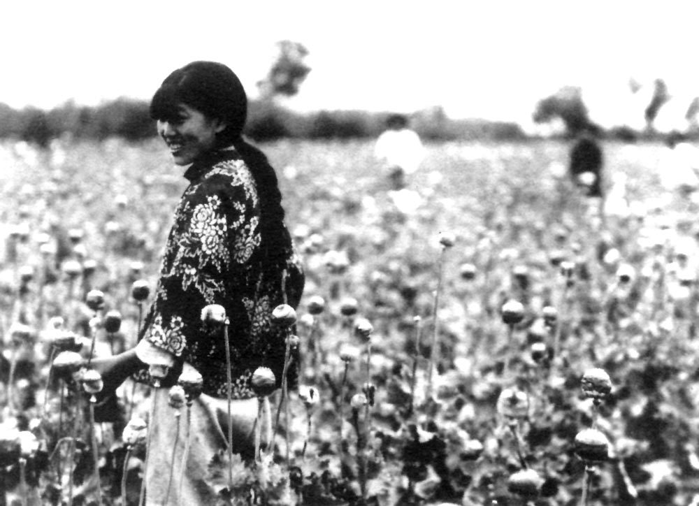
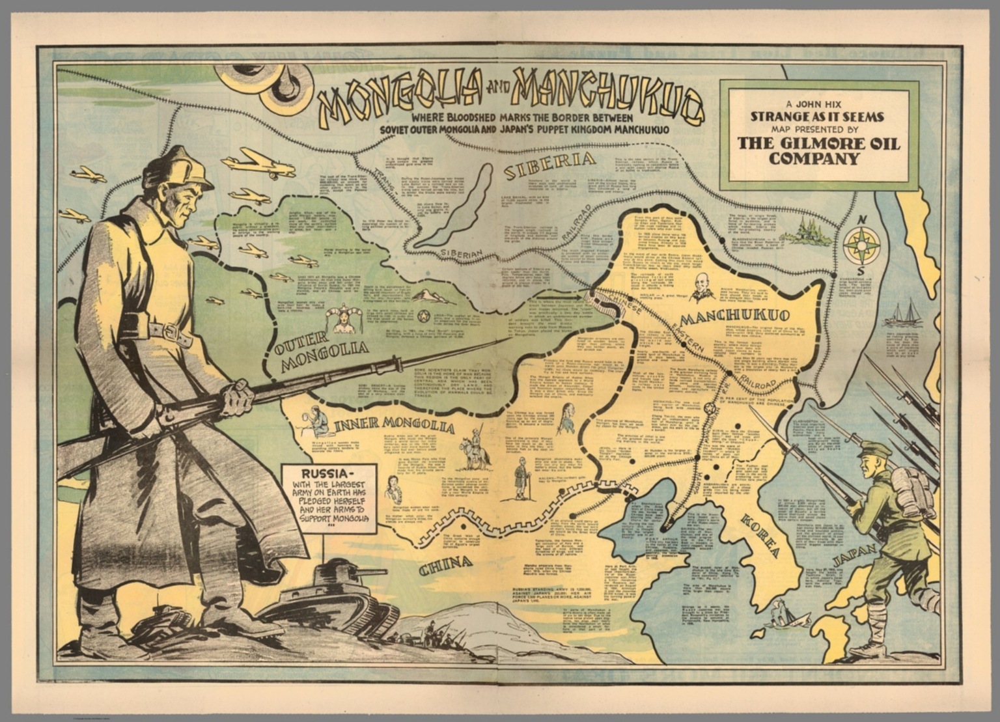

Source: source: 伪满洲国旧影, edited by the museum of Manchukuo Palace, published in 2001 (photograph in the public domain)

### Keywords

drug trafficking, 

### Points of discussion

### Readings
Note: compulsory readings have been marked in **bold**

* Wilson, Sandra. 1995. “The ‘New Paradise’: Japanese Emigration to Manchuria in the 1930s and 1940s.” *The International History Review* 17 (2): 249–86. https://doi.org/10.1080/07075332.1995.9640708.
* Tamanoi, Mariko Asano. 2000. “Knowledge, Power, and Racial Classifications: The ‘Japanese’ in ‘Manchuria.’” *The Journal of Asian Studies* 59 (2): 248–76. https://doi.org/10.2307/2658656.
* Bremen, Jan van, and Akitoshi Shimizu. 1999. *Anthropology and Colonialism in Asia and Oceania*. Psychology Press.

### Primary sources

### Audiovisual materials

* “MANCHUKUO THE NEWBORN EMPIRE - Manchukuo Japanese China Propaganda Film 2304 - YouTube.” n.d. Accessed September 24, 2018. https://www.youtube.com/watch?v=lzYLJt0kdjw.

### Links to other projects, websites, others

* Yoshida, Reiji. 2007. “Japan Profited as Opium Dealer in Wartime China.” *The Japan Times Online*, August 30, 2007. https://www.japantimes.co.jp/news/2007/08/30/national/japan-profited-as-opium-dealer-in-wartime-china/.

### to follow (@twitter)

Source: David Rumsey Historical Map Collection
